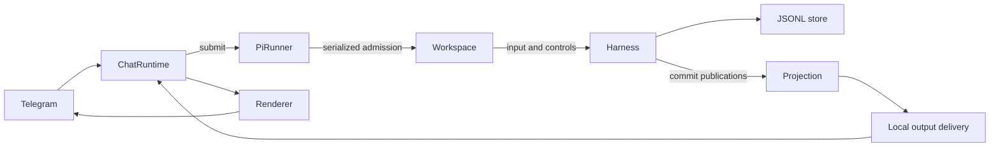

# pi-durable experiment

Branch: `codex/experiment-pi-durable`. Based on pi-pilot `847a0ec` (latest
`origin/main` when the experiment started).

The upstream repository was cloned alongside this checkout at
`D:\Project\Github\Self\pi-upstream`, revision
`4c6fb7cfe8c538a668726f6f8b3554098c39faee`. The implementation uses published
`@earendil-works/pi-durable`, `pi-ai`, and `chord` packages, all pinned to `1.0.1`.
The sibling clone is for investigation; installation does not depend on it.

## What changed

`AgentSessionRuntime`, `AgentSession`, `SessionManager`, `SettingsManager`, and
`ModelRuntime` are replaced with a `Harness`, a durable conversation, and a
pi-ai provider collection. There is no dependency on `pi-coding-agent`.

Each workspace gets a JSONL store under
`PI_PILOT_DATA_DIR/workspaces/<hash-of-workspace-path>`. It uses fsync and durable
task checkpoints. The `pilot.sessions` document records the selected conversation
and the conversations created by `/new`, in the same transaction as their creation.
Workspace switching closes the old store; reopening restores its selected session.

Every Telegram request is admitted directly to the durable inbox, keyed by its
original chat/message IDs. The old in-memory FIFO is removed. Mid-run input uses
`whenBusy: "steer"`; the harness owns admission, ordering, and turn boundaries.
`/stop` aborts the conversation, queued inputs, and its owned background work.
Process shutdown closes storage without aborting tasks. After restart, output is
attached before `resume()` starts unfinished work.

Output is a projection of committed durable state. A `viewState()` mount supplies
the initial conversation snapshot; `subscribeCommits()` supplies subsequent full
document values, entries, and terminal task/submission records. Chord delivers its
replicated-state frames asynchronously, so output and status use the publication's
document values to keep the final message and run completion on the same revision.
Commit observers only read and enqueue work; they never call asynchronous Harness
APIs or wait for Telegram.

`src/pi/events.ts` exposes presentation events with complete assistant text and a
stable message ID. The renderer can replace or shrink a partial, rather than assume
every update is a delta to append. A final committed assistant entry supplies the
complete answer. Retries, model turns, and steering boundaries split message
segments. Slow output consumers coalesce consecutive snapshots of the same message,
while retaining tool activity, boundaries, errors, and completion. Local sequence
watermarks let awaited operations drain their output; no `pilot.delivery` entries
or other UI synchronization records are written to the transcript.

The registry installs `CodingTools` (`read`, `write`, `edit`, `bash`) and the Pilot
system prompt. `NodeExecutionEnv` binds tool execution to the selected workspace.
pi-ai's built-in providers resolve credentials from environment variables or their
native ambient configuration. Models and thinking levels are stored per conversation.
An optional `PI_PILOT_MODEL=provider/model-id` selects a new workspace's initial
model; otherwise the first available model, sorted by provider and name, is selected.
With no credentials, `/models` and `/status` remain available to diagnose setup.

## Architecture after the migration

| Module                                        | Responsibility                                                                                 |
| --------------------------------------------- | ---------------------------------------------------------------------------------------------- |
| `src/pi/harness.ts`                           | Registry, system prompt, execution environment, storage policy, and Harness creation           |
| `src/pi/workspace.ts`                         | Workspace store, selected conversation, durable input/control admission, models, and lifecycle |
| `src/pi/runner.ts`                            | Small application facade; serialize admissions and lifecycle changes                           |
| `src/pi/conversation-output.ts`               | Committed-state projection, output sequencing, and snapshot coalescing                         |
| `src/pi/history.ts`                           | Paginated recent history, cached session totals, and activity ordering                         |
| `src/pi/types.ts`, `events.ts`                | Application contract and presentation events                                                   |
| `src/runtime/chat-runtime.ts`                 | Authorization, routing, durable submission, and notifications                                  |
| `src/render/turn-stream.ts`, `tool-format.ts` | Transport cadence, text replacement, segments, and tool formatting                             |

`submit()` returns the durable submission ID, whether it remains in the inbox, and
a separate `wait()` for settlement plus output drain. Chat handling acknowledges
admission immediately; callers that need a completed run use `run()`. Compaction
and stop also perform their control operation inside the facade's operation queue
and wait for output outside it. Waiting for a model or a slow output consumer must
not prevent steering, status, or stop. There is no second application input queue
or ChatRuntime event queue.

Switching sessions/workspaces and reloading check committed run, compaction, and
inbox state inside that same operation queue. Busy checks happen before output
drain, so rejected changes cannot trap `/stop` behind a slow transport. Idle
transitions drain old output before attaching a new conversation. Shutdown closes
the Harness and detaches observers, and the renderer cancels pending update and
typing timers. Attachment replays only current live progress; it does not resend
old completed answers.

History statistics are cached per conversation and invalidated by entry commits.
Recent messages stop reading once the requested count is found. Session selection
first sorts by activity using small pages, then computes summaries for the five
displayed sessions. Thinking-level selection reads the agent configuration directly,
without loading transcript statistics. Status calls the durable run state `Running`
because a busy run can be executing tools or retrying rather than streaming text.

The durable schema and workspace paths are unchanged by this refactor. Stores
created earlier on this experimental branch still open; old presentation markers,
if present, are ignored by history queries.

Output delivery itself remains local: Telegram acknowledgements and message IDs
are not persisted in a durable outbox. A crash after a run has committed its final
answer but before Telegram receives it can leave that answer available only via
`/recent`. Input deduplication prevents rerunning the request; this experiment does
not guarantee exactly-once Telegram delivery. A persistent outbox would be a
separate feature rather than a transcript synchronization marker.

## Compatibility intentionally removed

- Old pi JSONL sessions are not imported. `/resume` lists only durable conversations.
- Old `auth.json`/OAuth login state, `models.json` custom providers, and pi settings
  are not loaded. Set the appropriate provider API key in the bot environment.
- Old pi extension hooks, skills, prompt templates, packages, and automatic resource
  discovery are not loaded. AGENTS.md files are not automatically added to the prompt.
- `/delete` is removed: durable has no conversation deletion API. Histories remain
  in the workspace store.
- `/status` shows the model's context window but reports used context tokens as
  unknown, because the old SDK's estimator is unavailable. Cost is taken from
  durable's usage ledger, including compaction spend.
- Attachments remain local file references. The built-in durable read tool does
  not decode images. Media understanding and survival of temporary attachments
  across an OS reboot are outside this experiment.
- `/reload` reopens the durable store and reinstalls the built-in registry; it does
  not reload old pi resources.

## Validation

`bun run typecheck` and `bun test` check the actual installed durable runtime with
the faux model provider, without Telegram network access or paid model requests.
Integration cases include real read/write/edit/bash tools, streaming, duplicate
Telegram updates, steering, cancellation, sessions/workspaces, persisted model
choices, provider failure recovery, manual compaction, graceful shutdown recovery,
and recovery after forcibly killing a child process. Further cases cover slow
output with concurrent admission/cancellation, compaction cancellation, output
ordering/coalescing, text replacement/shrink, renderer disposal, paginated/cached
history, idle attachment, and absence of presentation entries in persisted storage.

The durable API is experimental upstream. The version pins keep this branch
reproducible. Use a single bot process per data directory; JSONL storage has a
single writer. This branch is tested locally on Windows with Bun. A live Telegram
bot, a real model provider, and a Docker image build require separate validation.
